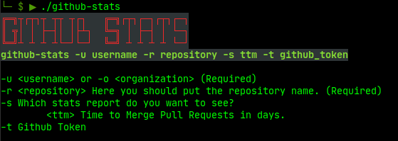

# Github Stats

A CLI tool to visualize Github stats from Pull Requests, Commits, Branches, Issues, etc.



## Getting Started

These instructions will get you a copy of the project up and running on your local machine for development and testing purposes. See deployment for notes on how to deploy the project on a live system.

### Prerequisites

What things you need to install the software and how to install them

```
Give examples
```

### Installing

A step by step series of examples that tell you how to get a development env running

Say what the step will be

```
Give the example
```

And repeat

```
until finished
```

End with an example of getting some data out of the system or using it for a little demo

## Running the tests

Explain how to run the automated tests for this system

### Break down into end to end tests

Explain what these tests test and why

```
Give an example
```

### And coding style tests

Explain what these tests test and why

```
Give an example
```

## Deployment

Add additional notes about how to deploy this on a live system

## Built With

* [Go](http://www.dropwizard.io/1.0.2/docs/) - The web framework used
* [Maven](https://maven.apache.org/) - Dependency Management
* [ROME](https://rometools.github.io/rome/) - Used to generate RSS Feeds

## Contributing

Please read [CONTRIBUTING.md](https://gist.github.com/PurpleBooth/b24679402957c63ec426) for details on our code of conduct, and the process for submitting pull requests to us.

## Versioning

We use [SemVer](http://semver.org/) for versioning. For the versions available, see the [tags on this repository](https://github.com/your/project/tags). 

## Authors

* **Rodolfo Bandeira** - *Initial work* - [rodolfobandeira](https://github.com/rodolfobandeira)

See also the list of [contributors](https://github.com/rodolfobandeira/github-stats/contributors) who participated in this project.

## License

This project is licensed under the MIT License - see the [LICENSE.md](LICENSE.md) file for details


---


# github-stats
Gets statistics from Github

How to run?

```bash
GITHUB_TOKEN=<YOUR_TOKEN> GITHUB_USERNAME=<YOUR_USERNAME> GITHUB_REPOSITORY=<REPO> go run github-stats.go
```

How to build?

```bash
make
```

It will create the binary files inside `/bin` for the following platforms: Linux, ARM, Windows, MacOS


Current options:

```
---------------------------------------------------
Github Stats - Which statistics do you want to see?
---------------------------------------------------
1- Time to Merge Pull Requests
0- Exit
```

Output:

```
Title: TITLE PR 1
Merged in: 3.000394 days

Title: TITLE PR 2
Merged in: 2.000394 days


Total Pull Requests: 2
Average Time to Merge: 2.5 days
```
